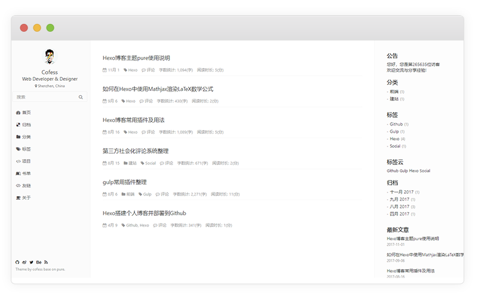
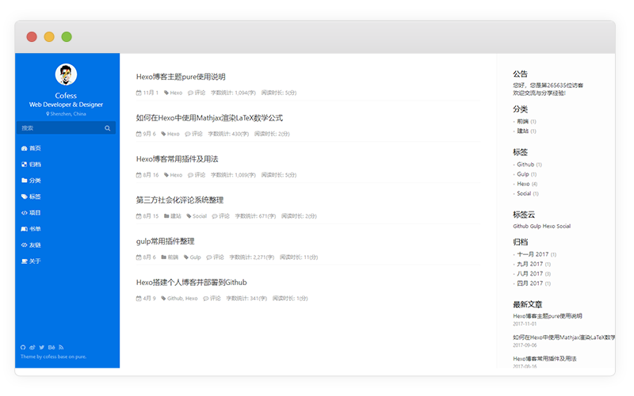

# pure

A brand new default theme for [[Hexo](https://hexo.io)].  [Preview](http://cofess.github.io/) | [中文说明文档](README.cn.md) | [iconfont](http://devbank.gitee.io/hexo-theme-pure/iconfont/demo_fontclass.html)



## Features

- Multiple languages support
- Comment support
- Tags page
- Categories page
- Social Media

## Skins





## Appearance

[Home](http://cofess.github.io/) | [Archives](http://cofess.github.io/archives/) | [Categories](http://cofess.github.io/categories/) | [Tags](http://cofess.github.io/tags/) | [Repository](http://cofess.github.io/repository/) | [Books](http://cofess.github.io/books/) | [Links](http://cofess.github.io/links/) | [About](http://cofess.github.io/about/)

## Install theme

Execute the following command under your `hexo` folder.

```
git clone https://github.com/cofess/hexo-theme-pure.git themes/pure
```
Then modify the property `theme` of the file `hexo/_config.yml`  to `theme: pure`

## Update theme

Execute the following command to update theme.

```
cd themes/pure
git pull
```
## Install plugin

### [hexo-wordcount](https://github.com/willin/hexo-wordcount)

```
npm install hexo-wordcount --save
```
### [hexo-generator-json-content](https://github.com/alexbruno/hexo-generator-json-content)

```
npm install hexo-generator-json-content --save
```
### [hexo-generator-feed](https://github.com/hexojs/hexo-generator-feed)

```
npm install hexo-generator-feed --save
```
### [hexo-generator-sitemap](https://github.com/hexojs/hexo-generator-sitemap)

```
npm install hexo-generator-sitemap --save
```
### [hexo-generator-baidu-sitemap](https://github.com/coneycode/hexo-generator-baidu-sitemap)

```
npm install hexo-generator-baidu-sitemap --save
```
## Data files
Sometimes you may need to use some data in templates which is not directly available in your posts, or you want to reuse the data elsewhere. For such use cases, Hexo 3 introduced the new Data files. This feature loads YAML or JSON files in source/_data folder so you can use them in your site.

For example, add links.yml in source/_data folder.

### links data

add links.yml in source/_data folder.

The format of the link :

```
Name:
    link: http://example.com
    avatar: http://example.com/avatar.png
    desc: description
```
Add a number of links, we just need to repeat the format according to the above.

## Blog optimization

### [hexo-neat](https://github.com/rozbo/hexo-neat)

> auto Minify html、js、css and make it neat

```
npm install hexo-neat --save
```

You can configure this plugin in `_config.yml`.

```
# hexo-neat
neat_enable: true
neat_html:
  enable: true
  exclude:  
neat_css:
  enable: true
  exclude:
    - '*.min.css'
neat_js:
  enable: true
  mangle: true
  output:
  compress:
  exclude:
    - '*.min.js' 
```

### [hexo-baidu-url-submit](https://github.com/huiwang/hexo-baidu-url-submit)

```
npm install hexo-baidu-url-submit --save
```

### [hexo-translate-title](https://github.com/cometlj/hexo-translate-title)
> translate the chinese title of Hexo blog to english words automatially

```
npm install hexo-translate-title --save
```

You can configure this plugin in `_config.yml`.

```yml
translate_title:
  translate_way: google    #google | baidu | youdao
  youdao_api_key: XXX
  youdao_keyfrom: XXX
  is_need_proxy: true     #true | false
  proxy_url: http://localhost:8123
```
## Mathjax Support

### [hexo-renderer-markdown-it-plus](https://github.com/CHENXCHEN/hexo-renderer-markdown-it-plus)

install

```
npm un hexo-renderer-marked --save
npm i hexo-renderer-markdown-it-plus --save
```

You can configure this plugin in `_config.yml`.

```
markdown_it_plus:
  highlight: true
  html: true
  xhtmlOut: true
  breaks: true
  langPrefix:
  linkify: true
  typographer:
  quotes: “”‘’
  plugins:
    - plugin:
        name: markdown-it-katex
        enable: true
    - plugin:
        name: markdown-it-mark
        enable: false  
```

Article enable mathjax

```
title: Hello World
mathjax: true
```

